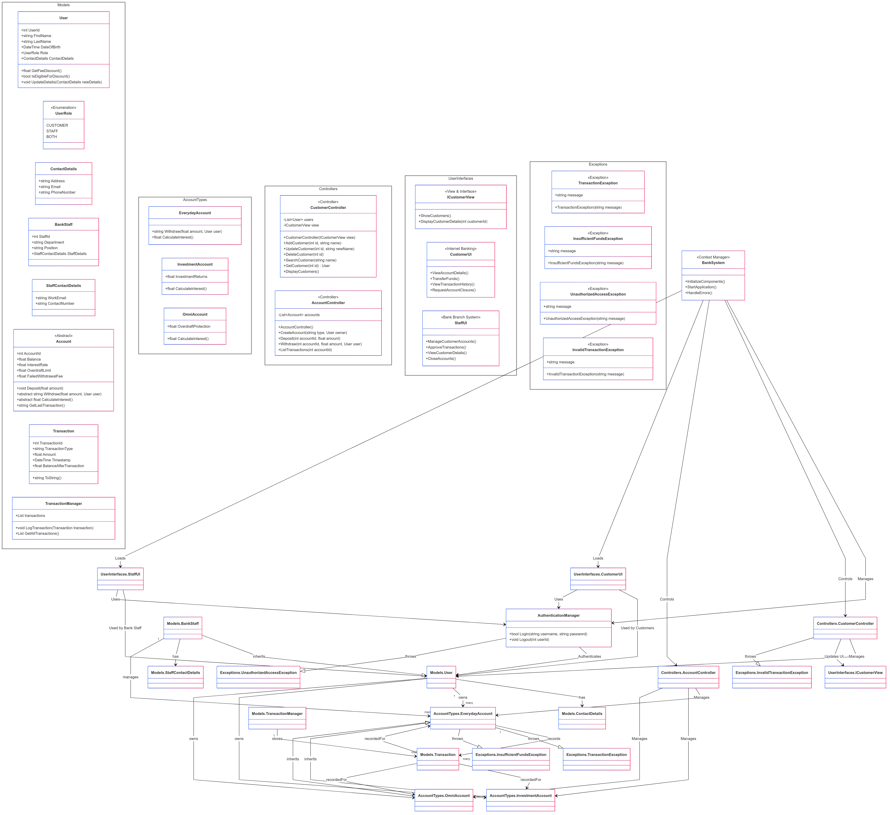

# IT7742 Bank Account Management
## Assignment 2 - Task 1: Analysis and UML Class Diagram
**Student:** Gracie Morgan-Maxwell  
**Student ID:** 20200261  
**Date:** March 2025  

## Scenario

The Bank Account Management System is designed to streamline customer banking operations while ensuring security, reliability, and ease of use. The system caters to both regular customers and bank staff, providing them with different levels of access and functionality. Customers can manage their Everyday, Investment, and Omni accounts, perform deposits and withdrawals, and view transaction history. Meanwhile, bank staff can oversee and manage customer accounts, approve transactions, and ensure compliance with banking regulations.

The system follows the MVC pattern, ensuring clear separation between business logic (Model), user interface (View), and interaction handling (Controller). It provides a user-friendly interface, enforces role-based authentication, and includes exception handling for unauthorized transactions or insufficient funds. Additionally, the system features a Transaction Manager to centralize all account transactions, allowing for auditing and improved financial tracking.

## Overview
This document provides a detailed analysis of the business requirements for managing customer information and the **Controller Class** design following the **MVC (Model-View-Controller) Pattern**. The accompanying UML Class Diagram visually represents the relationships between entities in the system.  

## 1. Business Requirements Analysis
The bank requires a **structured and maintainable** system to manage customer accounts, staff details, and transactions while following the **MVC pattern**. The system must:
- Support multiple account types (**Everyday, Investment, Omni**).
- Store all transactions per account rather than a centralized transaction log.
- Differentiate between **customers and bank staff**.
- Implement **robust exception handling** for transaction failures.
- Offer a **user-friendly UI** for managing accounts.
- Ensure **secure authentication** and role-based access control.

## 2. Controller Class Design
### **2.1 Attributes**
The **CustomerController** and **AccountController** classes manage customer and account data, ensuring proper interaction between the **model (business logic) and view (UI).**

#### **CustomerController Attributes:**
- `users: List<User>` - Stores all customer and staff records.
- `view: ICustomerView` - Interface reference for UI interaction.

#### **AccountController Attributes:**
- `accounts: List<Account>` - Maintains a list of bank accounts.

### **2.2 Methods**
#### **CustomerController Methods:**
- `CustomerController(ICustomerView view)`: Initializes the controller with a UI reference.
- `AddCustomer(int id, string name)`: Adds a new customer.
- `UpdateCustomer(int id, string newName)`: Updates customer details.
- `DeleteCustomer(int id)`: Removes a customer.
- `SearchCustomer(string name)`: Searches for a customer.
- `GetCustomer(int id) -> User`: Retrieves customer details.
- `DisplayCustomers()`: Displays customer information in the UI.

#### **AccountController Methods:**
- `CreateAccount(string type, User owner)`: Creates an account for a customer.
- `Deposit(int accountId, float amount)`: Deposits money into an account.
- `Withdraw(int accountId, float amount, User user)`: Handles withdrawals, enforcing overdraft and penalty rules directly within the base `Account` class.
- `ListTransactions(int accountId)`: Retrieves transaction history for an account.

## 3. Design Rationale (300 Words)
The **MVC architecture** ensures **separation of concerns**, making the system modular and scalable. The **Controller Classes** are an intermediary between the **Model (business logic)** and the **View (user interface)**, enabling **efficient data management and presentation**.

### **Why MVC?**
1. **Scalability:** Allows easy integration of new features (e.g., additional account types).
2. **Maintainability:** Changes to the UI do not impact the business logic.
3. **Security:** Controllers enforce authentication and role-based access.

### **Controller Role in Data Management**
The **CustomerController** and **AccountController** manage interactions with the **User and Account Models**, ensuring **data consistency and enforcing rules** (e.g., preventing overdrafts in non-Omni accounts). Auditing is simplified by keeping transaction records per account while maintaining system integrity.

### **Exception Handling and Penalty System**
The system introduces **custom exceptions** to manage errors:
- `InvalidTransactionException`: For invalid operations.
- `UnauthorizedAccessException`: For restricted actions.
- `InsufficientFundsException`: For withdrawals exceeding balance.

Additionally, all penalties for failed withdrawals are now **applied within the `Withdraw()` method** of the `Account` class, ensuring **consistent penalty enforcement** across all account types.

## 4. Implementation of Customer and Controller Classes
The **Customer and Controller Classes** will be implemented based on the UML design. The **UI will integrate with controllers** for seamless user interaction, ensuring real-time updates and smooth account management.

## 5. User Interface Design
The **UI Forms** will allow users to **add, update, and delete customer information** while maintaining branding consistency. The forms will be interactive, ensuring **smooth navigation and error handling**.

## 6. Conclusion
This document outlines the MVC-based Controller design for managing customer accounts, ensuring scalability, maintainability, and security. The accompanying UML_Diagram.png provides a visual representation of the architecture, ensuring clear documentation of class relationships and responsibilities.

