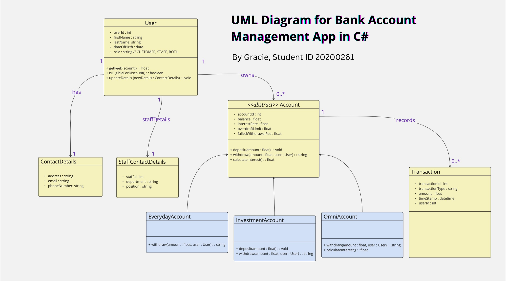

# Bank Account Management Application ReadMe 

## Overview

This repository contains an application designed to manage customer bank accounts. It supports various account types and specific functionality for both regular customers and bank staff. The primary functionality includes deposit, withdrawal, and interest calculation. Additionally, bank staff receive a 50% discount on transaction fees.

### Contents

- **Task 1**: `ReadMe.md` - Analysis and UML Class Diagram with detailed explanations of the design choices, including object-oriented and SOLID principles. A UML diagram is also provided in `UML_Diagram.png`.
- **Task 2**: `BankApp.Lib` - Implementing the UML classes in C#. This task includes inheritance, constructors, and methods for managing account information and transactions.
- **Task 3**: `BankingApp.Gui` - A GUI prototype that integrates the account classes, allowing users to interact with different account types, perform transactions, and view account information.
- **Task 4**: GitHub Repository setup - Code organization, documentation, and repository setup guidelines.

---

## Scenario

The application facilitates deposit and withdrawal transactions for bank customers, supporting distinct account types with customized features. It also includes a fee discount for bank staff.

### Customers
Customers (including staff members) have the following attributes:
- **Customer Number**
- **Name**
- **Contact Details**

### Accounts
The application includes three account types:
1. **Everyday Account**
   - No interest, overdraft, or transaction fees.
2. **Investment Account**
   - Variable interest rates, no overdraft, fee for failed transactions, and interest calculation.
3. **Omni Account**
   - Interest applied on balances over $1000, specific overdraft limit, failed transaction fees, and simple deposit and interest calculation methods.

Each account type is implemented with attributes and methods for:
- **Unique ID**: Account identifier.
- **Balance**: Account balance.
- **Interest Rate**: Interest rate (if applicable).
- **Overdraft Limit**: Allowed overdraft limit (if applicable).
- **Failed Withdrawal Fee**: Fee for failed withdrawal attempts.
- **Deposit Method**: Adds to account balance.
- **Withdrawal Method**: Handles withdrawal, overdraft checks, and fee deductions.
- **Interest Calculation Method**: Calculates and adds interest to the balance (if applicable).

---

## Tasks

### Task 1 - UML Class Diagram and Explanation
[x] **File**: `ReadMe.md`
[x] **Diagram**: `UML_Diagram.png`

This document includes:
[x] A UML class diagram with associations, inheritance, and abstract classes.
[x] Detailed explanations of design choices, including object-oriented and SOLID principles.
[x] Use case scenarios demonstrating account management and transaction logging.

### Task 2 - C# Class Implementation
[x] **Folder**: `BankingApp.Lib`

Implementation of the UML classes in C#, focusing on:
[x] **Inheritance and access modifiers** for encapsulation.
[x] **Constructors** with relevant parameters for each class.
[x] Methods for account information, balance management, and transaction details.
[x] Adherence to **C# coding standards** and best practices, with clear documentation for each class and method.

### Task 3 - GUI Form Prototype
[-] **Folder**: `BankingApp.GUI.cs`

A GUI prototype that integrates the account classes and provides a user interface for managing accounts:
- **Functionality**:
  [-] Account selection and information display.
  [-] Withdrawals, deposits, and interest calculation.
  [-] Transaction history displayed in a list box.
  [-] Error handling and input validation.
- **Sample Data**:
  [-] A hardcoded user "John Doe" with Everyday, Investment, and Omni accounts.

### Task 4 - GitHub Repository Setup
[x] **Repository**: [https://github.com/gracemorganmaxwell/C#_BankingApp_A1]

All project files and documentation are organised within this private GitHub repository:
[x] **Access**: Add the tutor as a collaborator for access.
[-] **Documentation**: All code and files are well-documented and organised to facilitate understanding and collaboration.

----

## Task 1: UML Class Diagram and Explanation

### UML Class Diagram for Bank Account Management Application

The following design utilises advanced object-oriented principles—**abstraction, inheritance, polymorphism, and encapsulation**—to meet the requirements of the Bank Account Management Application. This application includes role-based fee discounts, account management, and detailed transaction logging and reporting. The `User` class handles role-based distinctions between customers and staff. The `Account` class is abstract, enforcing behaviour through subclasses, and the `Transaction` class supports detailed transaction tracking.

### UML Class Diagram Visual



### Class Definitions with Object-Oriented Principles and SOLID Principles

1. **User Class**
   - **Attributes**:
     - `userId`: Unique identifier for each user.
     - `firstName`: First name of the user.
     - `lastName`: Last name of the user.
     - `dateOfBirth`: Date of birth of the user.
     - `contactDetails`: Aggregated association with `ContactDetails`.
     - `role`: A string representing the role (`CUSTOMER`, `STAFF`, or `BOTH`).
   - **Methods**:
     - `getFeeDiscount()`: Returns a 50% discount (0.5 multiplier) if the user’s role includes staff privileges.
     - `isEligibleForDiscount()`: Returns `true` if the user’s role is `STAFF` or `BOTH`.
     - `updateDetails(newDetails: ContactDetails): void`: Updates the user’s contact information.
   - **Relationships**:
     - Aggregates `ContactDetails` for modular contact information management.
     - Associated with multiple `Account` instances, allowing users to own various accounts.
   - **Explanation**: The `User` class leverages **encapsulation** by managing contact details through `updateDetails`, preserving data integrity. The `role` attribute and `getFeeDiscount()` method enable **polymorphic behaviour** for fee discounts, distinguishing user roles during transactions. The **Single Responsibility Principle (SRP)** is followed, as `User` only manages user-specific information.

2. **ContactDetails Class**
   - **Attributes**:
     - `address`, `email`, `phoneNumber`: General contact fields.
   - **Relationships**:
     - Aggregated by `User`, allowing flexible contact management.
   - **Explanation**: The `ContactDetails` class **encapsulates** user contact information, separating customer and staff-specific fields cleanly. This class supports **SRP**, as it solely handles contact information.

3. **StaffContactDetails Class**
   - **Attributes**:
     - `staffId`: Unique identifier for staff.
     - `department`: Department where the staff member works.
     - `position`: Job position of the staff member.
   - **Relationships**:
     - Inherits from `ContactDetails`, adding fields specific to staff.
   - **Explanation**: By inheriting from `ContactDetails`, **inheritance** and the **Liskov Substitution Principle (LSP)** are applied, allowing `StaffContactDetails` to replace `ContactDetails` where needed. **Open/Closed Principle (OCP)** is upheld by extending `ContactDetails` without modifying it, adapting to staff-specific requirements.

4. **Account Class (Abstract)**
   - **Attributes**:
     - `accountId`: Unique identifier for each account.
     - `balance`: Tracks the current account balance.
     - `interestRate`: Stores the interest rate (applicable for relevant accounts).
     - `overdraftLimit`: Permitted overdraft amount for certain accounts.
     - `failedWithdrawalFee`: Fee incurred for failed withdrawals.
   - **Methods**:
     - `deposit(amount: float): void`: Adds funds to the account balance.
     - `withdraw(amount: float, user: User): string`: Abstract method for subclasses to handle specific withdrawal behaviour.
     - `calculateInterest(): float`: Abstract method for calculating and adding interest if applicable.
   - **Relationships**:
     - Associated with `User`, as each user may own multiple accounts.
     - Base class for specific account types (`EverydayAccount`, `InvestmentAccount`, `OmniAccount`).
   - **Explanation**: The `Account` class exemplifies **abstraction** and **inheritance**, centralizing shared attributes and methods while requiring subclasses to implement `withdraw` and `calculateInterest`. This design aligns with the **OCP** by making it easy to add new account types without modifying the `Account` class. **Dependency Inversion Principle (DIP)** is demonstrated using an abstract `Account` class rather than depending on concrete implementations.

5. **EverydayAccount Class**
   - **Methods**:
     - Implements `withdraw(amount: float, user: User): string`: Allows withdrawals without fees, interest, or overdrafts.
     - Omits `calculateInterest`, as this account type does not earn interest.
   - **Explanation**: This class inherits functionality from `Account`, exemplifying **inheritance** and **polymorphism** by adapting `withdraw` behavior to business rules. **LSP** is maintained, as `EverydayAccount` can be used interchangeably with `Account`.

6. **InvestmentAccount Class**
   - **Methods**:
     Implements `withdraw(amount: float, user: User): string`: This checks for sufficient funds and applies a fee if the transaction fails, adjusted for staff with `getFeeDiscount()`.
     - Implements `calculateInterest(): float`: Calculates and applies interest to the balance.
   - **Explanation**: `InvestmentAccount` demonstrates **polymorphism** by overriding `withdraw` and `calculateInterest` to enforce specific rules, thus meeting investment account requirements. **OCP** is respected, as modifications are isolated to this class.

7. **OmniAccount Class**
   - **Methods**:
     Implements `withdraw(amount: float, user: User): string`: This allows overdrafts within the specified limit and applies a fee for failed withdrawals, adjusted for staff discounts.
     - Implements `calculateInterest(): float`: Applies interest only when the balance exceeds a specified threshold (e.g., $1000).
   - **Explanation**: `OmniAccount` implements complex business rules, using **polymorphism** to adapt `withdraw` and `calculateInterest` while adhering to the **LSP**, as it functions seamlessly in place of `Account`. The use of `calculateInterest` and `withdraw` aligns with the **Interface Segregation Principle (ISP)**, where subclasses only implement relevant methods.

8. **Transaction Class**
   - **Attributes**:
     - `transactionId`, `transactionType`, `amount`, `timestamp`, `userId`: Stores details for each transaction.
   - **Relationships**:
     - Associated with `Account` in a one-to-many relationship (an account may have multiple transactions).
   - **Explanation**: `Transaction` records transaction history, facilitating detailed reporting. This follows **encapsulation** by managing transaction data independently. **SRP** is adhered to, as `Transaction` is solely responsible for logging transaction details.

### Explanation of Design Choices with SOLID Principles

#### Key Design Choices

1. **Role-Based Fee Discounts**:
   - The `User` class’s `role` attribute differentiates customers, staff, and dual-role users. The `getFeeDiscount()` method provides a 50% discount for staff members, checked within each account’s `withdraw` method. Additionally, `isEligibleForDiscount()` returns a Boolean indicating whether the user qualifies for discounts, simplifying eligibility checks. **Encapsulation** is applied by centralizing role logic in the `User` class.

2. **Abstract Account Class and Inheritance**:
   - The abstract `Account`

 class consolidates shared attributes and methods, such as `balance` and `withdraw`, enforcing that subclasses implement specific behavior through **polymorphism**. This design supports the **OCP**, enabling new account types without modifying existing code. The **DIP** is upheld by relying on abstract methods, as higher-level modules depend on abstractions rather than specific implementations.

3. **Transaction Logging for Reporting**:
   - The `Transaction` class logs each transaction, supporting traceability and reporting requirements. Its association with `Account` enables each account to maintain an accurate history, satisfying **encapsulation** by managing transaction-specific data. **SRP** ensures `Transaction` is focused on logging and reporting.

4. **Encapsulation and Contact Management**:
   - `ContactDetails` encapsulates user contact information, while `StaffContactDetails` adds staff-specific fields. The `updateDetails` method in `User` ensures that contact updates are managed centrally, aligning with **encapsulation** principles and **SRP**. 

#### Use Case Scenarios with OOP Principles

- **Adding a New Account and Performing Transactions**:
   - A new account is created by instantiating the appropriate subclass (e.g., `EverydayAccount`). Each account allows deposits through the `deposit` method. Withdrawals, executed via `withdraw`, consider the user’s role in fee adjustments, ensuring business rules are respected. **Polymorphism** is applied as each account subclass adapts `withdraw` behaviour to its requirements.

- **Generating a Transaction Report**:
   - Each account maintains a collection of `Transaction` objects, enabling transaction reports. The application can generate comprehensive transaction histories for each account by iterating through' Transaction' instances, supporting **encapsulation** by maintaining transaction data within the `Transaction` class.


## Task 2: UML Class Designs Implemented

The `BankingApp.Lib` namespace encapsulates the implementation of the classes outlined in the UML diagram. These classes leverage object-oriented principles to provide a modular and extensible architecture for the Bank Account Management Application. Below is the detailed implementation plan for each class.

---

### **Namespace**: `BankingApp.Lib`

```csharp
namespace BankingApp.Lib
{
    // All classes and interfaces in the library will be encapsulated within this namespace.
}
```

---

### **[1. User Class](https://github.com/gracemorganmaxwell/AdvancedProgramming_BankingApp_A1/blob/main/User.cs)**

```csharp
namespace BankingApp.Lib
{
    using System;

    // User class to handle customer and staff information
    public class User
    {
        public int UserId { get; private set; }
        public string FirstName { get; set; }
        public string LastName { get; set; }
        public DateTime DateOfBirth { get; set; }
        public ContactDetails ContactDetails { get; private set; }
        public string Role { get; private set; } // CUSTOMER, STAFF, or BOTH
        private static int userCount = 0;

        public User(string firstName, string lastName, DateTime dateOfBirth, ContactDetails contactDetails, string role)
        {
            UserId = ++userCount;
            FirstName = firstName;
            LastName = lastName;
            DateOfBirth = dateOfBirth;
            ContactDetails = contactDetails;
            Role = role;
        }

        public float GetFeeDiscount()
        {
            return Role == "STAFF" || Role == "BOTH" ? 0.5f : 1.0f;
        }

        public bool IsEligibleForDiscount()
        {
            return Role == "STAFF" || Role == "BOTH";
        }

        public void UpdateDetails(ContactDetails newDetails)
        {
            ContactDetails = newDetails;
        }
    }
}
```

---

### **[2. ContactDetails Class](https://github.com/gracemorganmaxwell/AdvancedProgramming_BankingApp_A1/blob/main/ContactDetails.cs)**

```csharp
namespace BankingApp.Lib
{
    public class ContactDetails
    { 
        public string Address { get; set; }
        public string Email { get; set; }
        public string PhoneNumber { get; set; }

        public ContactDetails(string address, string email, string phoneNumber)
        {
            Address = address;
            Email = email;
            PhoneNumber = phoneNumber;
        }
    }
}
```

---

### **[3. StaffDetails Class](https://github.com/gracemorganmaxwell/AdvancedProgramming_BankingApp_A1/blob/main/StaffContactDetails.cs)**

```csharp
namespace BankingApp.Lib;

public class StaffContactDetails : ContactDetails
{
    public int StaffId { get; private set; }
    public string Department { get; set; }
    public string Position { get; set; }

    public StaffContactDetails(string address, string email, string phoneNumber, int staffId, string department, string position)
        : base(address, email, phoneNumber)
    {
        StaffId = staffId;
        Department = department;
        Position = position;
    }
}
```

---

### **[4. (Abstract) Account Class](https://github.com/gracemorganmaxwell/AdvancedProgramming_BankingApp_A1/blob/main/Account.cs)**

```csharp
namespace BankingApp.Lib;

public abstract class Account
{
    public int AccountId { get; private set; }
    public float Balance { get; protected set; }
    public float InterestRate { get; protected set; }
    public float OverdraftLimit { get; protected set; }
    public float FailedWithdrawalFee { get; protected set; }
    private static int accountCount = 0;
    protected List<Transaction> transactions;

    public Account(float interestRate, float overdraftLimit, float failedWithdrawalFee)
    {
        AccountId = ++accountCount;
        InterestRate = interestRate;
        OverdraftLimit = overdraftLimit;
        FailedWithdrawalFee = failedWithdrawalFee;
        transactions = new List<Transaction>();
    }

    public void Deposit(float amount)
    {
        Balance += amount;
        transactions.Add(new Transaction("Deposit", amount, Balance));
    }

    public abstract string Withdraw(float amount, User user);

    public abstract float CalculateInterest();

    public string GetLastTransaction()
    {
        return transactions.Count > 0 ? transactions[^1].ToString() : "No transactions available.";
    }
}
```

---

### **[5. EverydayAccount Class](https://github.com/gracemorganmaxwell/AdvancedProgramming_BankingApp_A1/blob/main/EverydayAccount.cs)**

```csharp
namespace BankingApp.Lib
{
    public class EverydayAccount : Account
    {
        public EverydayAccount() : base(interestRate: 0, overdraftLimit: 0, failedWithdrawalFee: 0) {}

        public void Deposit(float amount)
        {
            throw new NotImplementedException();
        }

        public override string Withdraw(float amount, User user)
        {
            if (amount > Balance)
            {
                return "Withdrawal failed: Insufficient funds.";
            }
            Balance -= amount;
            transactions.Add(new Transaction("Withdrawal", -amount, Balance));
            return $"Withdrawal successful. New balance: {Balance}";
        }

        public override float CalculateInterest()
        {
            return 0; // No interest for EverydayAccount
        }
    }
}
```

---

### **[6. InvestmentAccount Class](https://github.com/gracemorganmaxwell/AdvancedProgramming_BankingApp_A1/blob/main/InvestmentAccount.cs)**

```csharp
namespace BankingApp.Lib;

public class InvestmentAccount : Account
{
    public InvestmentAccount(float interestRate, float failedWithdrawalFee) 
        : base(interestRate, overdraftLimit: 0, failedWithdrawalFee) {}

    public override string Withdraw(float amount, User user)
    {
        if (amount > Balance)
        {
            Balance -= FailedWithdrawalFee * user.GetFeeDiscount();
            transactions.Add(new Transaction("Failed Withdrawal", -FailedWithdrawalFee, Balance));
            return "Withdrawal failed: Insufficient funds. Fee applied.";
        }
        Balance -= amount;
        transactions.Add(new Transaction("Withdrawal", -amount, Balance));
        return $"Withdrawal successful. New balance: {Balance}";
    }

    public override float CalculateInterest()
    {
        float interest = Balance * InterestRate;
        Balance += interest;
        transactions.Add(new Transaction("Interest Added", interest, Balance));
        return interest;
    }
}
```

---

### **[7. OmniAccount Class](https://github.com/gracemorganmaxwell/AdvancedProgramming_BankingApp_A1/blob/main/OmiAccount.cs)**

```csharp
namespace BankingApp.Lib;

public class OmniAccount : Account
{
    public OmniAccount(float interestRate, float overdraftLimit, float failedWithdrawalFee) 
        : base(interestRate, overdraftLimit, failedWithdrawalFee) {}

    public override string Withdraw(float amount, User user)
    {
        if (amount > Balance + OverdraftLimit)
        {
            Balance -= FailedWithdrawalFee * user.GetFeeDiscount();
            transactions.Add(new Transaction("Failed Withdrawal", -FailedWithdrawalFee, Balance));
            return "Withdrawal failed: Overdraft limit exceeded. Fee applied.";
        }
        Balance -= amount;
        transactions.Add(new Transaction("Withdrawal", -amount, Balance));
        return $"Withdrawal successful. New balance: {Balance}";
    }

    public override float CalculateInterest()
    {
        if (Balance > 1000)
        {
            float interest = Balance * InterestRate;
            Balance += interest;
            transactions.Add(new Transaction("Interest Added", interest, Balance));
            return interest;
        }
        return 0;
    }
}
```

---

### **[8. Transaction Class](https://github.com/gracemorganmaxwell/AdvancedProgramming_BankingApp_A1/blob/main/Transaction.cs)**

```csharp
namespace BankingApp.Lib;

public class Transaction
{
    public int TransactionId { get; private set; }
    public string TransactionType { get; private set; }
    public float Amount { get; private set; }
    public DateTime Timestamp { get; private set; }
    public float BalanceAfterTransaction { get; private set; }
    private static int transactionCount = 0;

    public Transaction(string transactionType, float amount, float balanceAfterTransaction)
    {
        TransactionId = ++transactionCount;
        TransactionType = transactionType;
        Amount = amount;
        BalanceAfterTransaction = balanceAfterTransaction;
        Timestamp = DateTime.Now;
    }

    public override string ToString()
    {
        return $"{TransactionType}: {Amount} on {Timestamp}, Balance after: {BalanceAfterTransaction}";
    }
}
```

---

This implementation provides a comprehensive library (`BankingApp.Lib`) that the GUI project (`BankingApp.Gui`) can integrate. Each class adheres to OOP principles and is structured to maximise extensibility and maintainability. Task 3 will build on this by implementing a user-friendly GUI for interacting with these classes.


